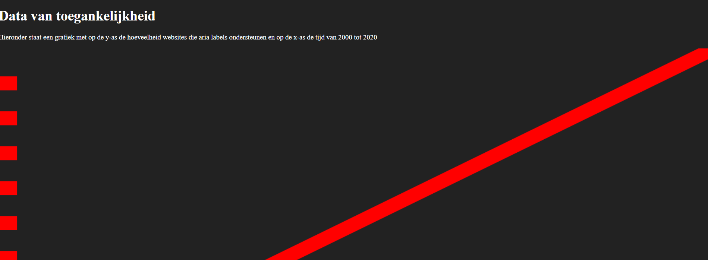
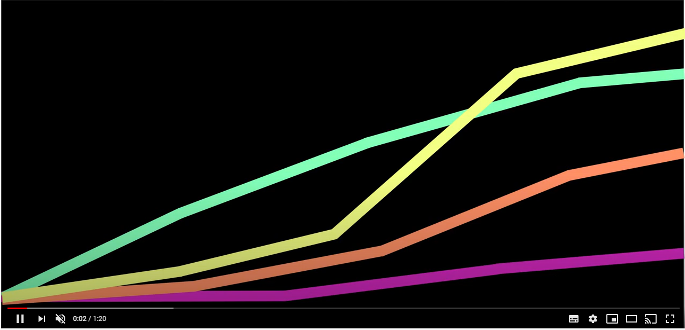
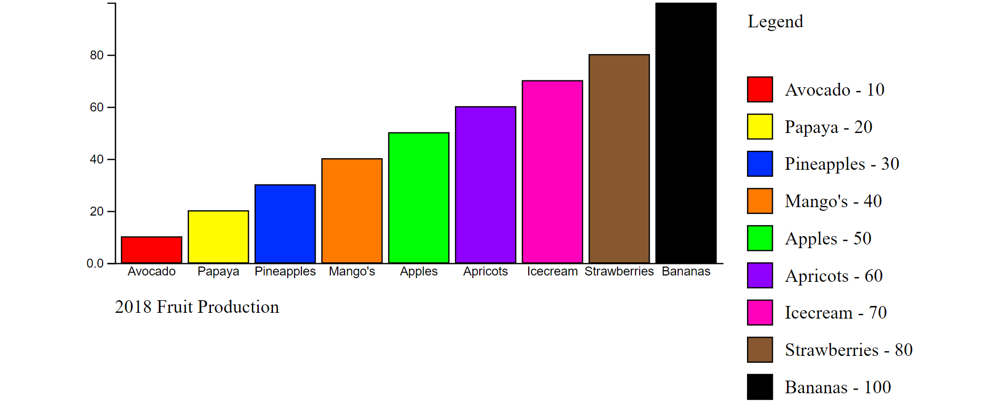
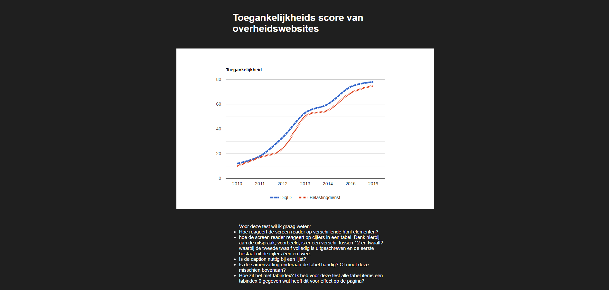
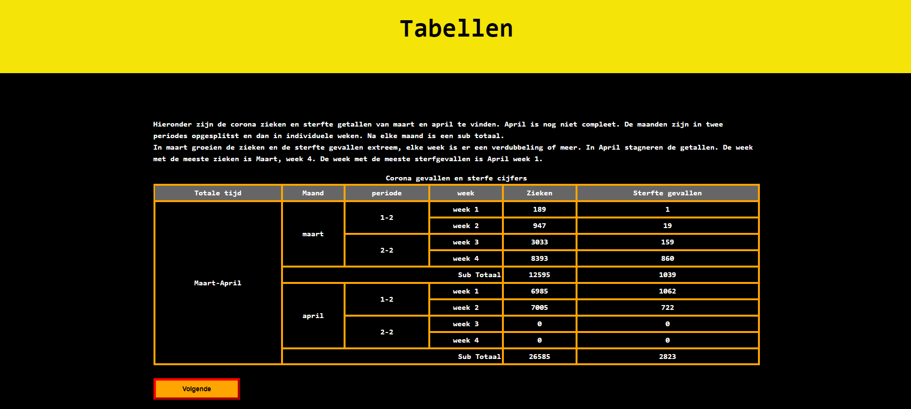
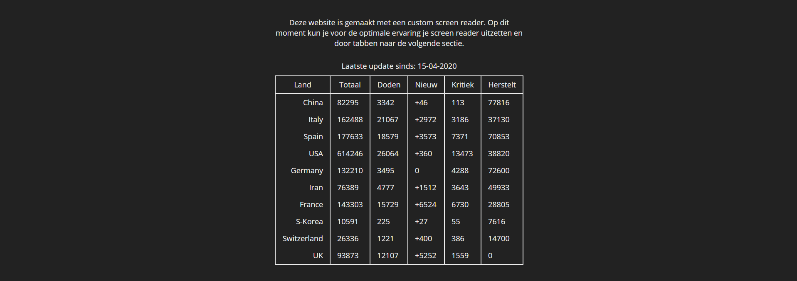
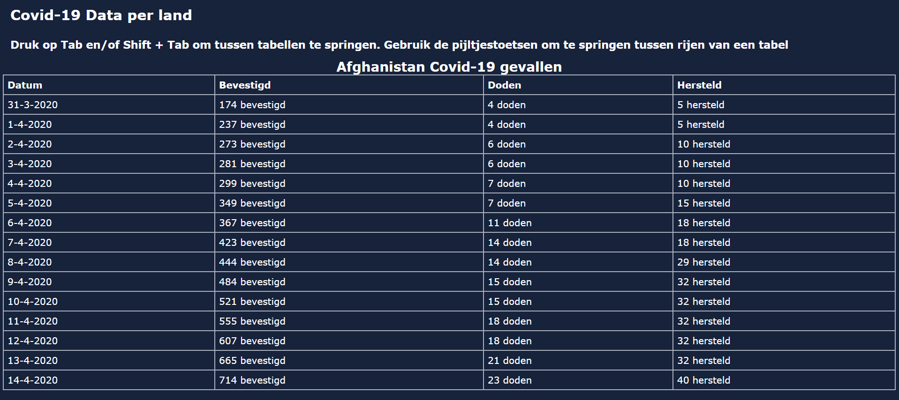
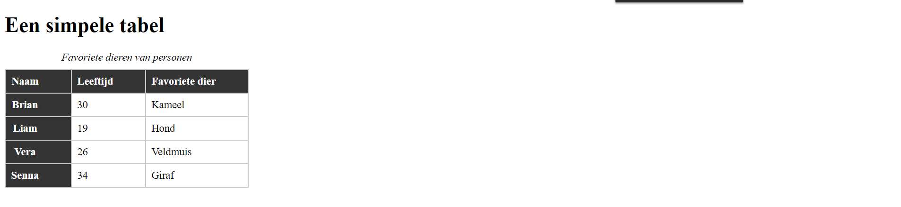
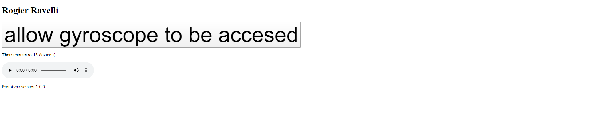

# test 1 - Bas
https://aaraar.github.io/web-design-1920

*enkele grafiek in rood op zwart.*

past niet helemaal in beeld.
Kan wel de h1 (titel) lezen.
visueel ziet hij de x en y as.
afstanden tussen de blokjes zijn voor hem waarneembaar.
Er wordt met audio een omschrijving gegeven van wat er zichtbaar is.

met supernova kan hij wat hij ziet vergroten en verkleinen. Dat zien wij niet, maar op zijn scherm wordt dan ingezoomd.

# test 2 - Simone
https://www.youtube.com/watch?v=gb44xXou2Ds&feature=youtu.be

*filmpje met verschillende lijnen en trends die omschreven worden.*

Youtube blijkt niet heel toegankelijk. Autoplay is moeilijk tegen te houden en knoppen zijn klein.

Hij vond dit heel mooi. Erg duidelijk. Voor hem goed waar te nemen hoe de lijnen lopen. Typen is voor hem erg makkelijk. Door de eerste letter van een land in te tikken, krijgt hij dan de grafiek voor een bepaald land. Het was moeilijk voor hem om de video te stoppen. Dat had hij graag wel willen kunnen.

Kleurcontrast was goed.

Wat voor onderwerpen vindt hij interessant
- Hoeveelheid duurzame energie en trends daarin.
- toegankelijkheidsscores van diensten/websites

# test 3 - Nick
https://countnick.github.io/web-design-1920/

*test van een staafdiagram met geluiden die aangeven hoe hoog de staven zijn.*

Kleuren zijn goed te onderscheiden. Labels kan hij ook nog lezen.
Hij zou wel graag de waarden ook willen weten, maar de geluiden zijn een mooi idee. Het is ook nog niet duidelijk dat hij er doorheen kan klikken en dat hij de pijltjestoetsen kan gebruiken om er doorheen te gaan.

## Welk geluid zou hij prettig vinden?
Hij speelt zelf gitaar. Vind cello of piano ook heel mooi.

Naast de geluiden zou het fijn zijn als de naam en hoeveelheid ook genoemd wordt. Hij kan nu nog wel veel lezen, maar dat gaat slechter worden.

# test 4 - Wouter
https://mokerstier.github.io/web-design-1920/

*test van een interactieve grafiek met aanklikbare punten*

Dit is gemaakt met google charts.
Wanneer een punt in de grafiek wordt aangeklikt, springt de pagina naar een tabel met de gekozen waarde.

De screenreader leest eerst de titels, maar raast daarna door de pagina heen en noemt alle waarden op de assen. Dat was niet helemaal de bedoeling. Misschien een goed idee om dan toch de info over verschillende pagina's te verdelen zodat niet meteen alles voorgelezen wordt.

Onduidelijk hoe Roger daarna weer terug komt waar hij was. Tabben leek door de screenreader geblokkeerd te worden. Later werkte dat wel. Hij gebruikt de pijltjestoetsen om te scrollen. Wanneer hij door de tabel tabt wordt alleen 'kolom 1, rij 7' uitgesproken. De waarden worden niet genoemd.

De samenvatting was nuttig.

# test 5 - Max
https://mordock.github.io/web-design-1920/

*test met verschillende typen tabellen*

## Tabel 1
Op de eerste pagina staat een tabel met gele lijnen op zwart. Deze valt gedeeltelijk buiten beeld. Hij is iets te groot voor zijn scherm.
De screenreader werkt goed voor de samenvatting. 

Zou handig zijn als een tabel of grafiek ook aangekondigd wordt in de titel. Nu wordt alleen de kop voorgelezen en daarna alle waarden.

Ook hier raast de screenreader wel weer in 1 keer over de pagina. Kan deze misschien gepauzeerd worden? Misschien handiger zelf alle text to speech op de pagina uit te laten voeren, zonder de screenreader. Dan moet wel aangekondig worden dat de screenreader op de pagina niet nodig is.

Tabben skipt de volledige tabel.
Een samenvatting heeft hij liever voor een tabel of grafiek dan erna.
Contrast is wel goed. Geel is voor hem moeilijk, maar werkt wel als achtergrond.

## Tabel 2
Wit op grijze achtergrond werkt natuurlijk heel slecht.

## Tabel 3
rode lijnen met zwarte tekst op grijze achtergrond. Deze is goed zichtbaar. Beter nog dan de eerste.

# test 6 - Sjors
https://sjors-web-design-1920.herokuapp.com/

*test van een custom screenreader die met volzinnen een tabel duidt.*

Voor een screenreader misschien handig om pas tekst weer te geven na bepaalde handelingen of deze in eerste instantie van de reader te excluden en bij bepaalde acties zichtbaar te maken.

Witte tekst op donkergrijs lijkt niet per se heel makkelijk te lezen.
Hij heeft inderdaad de screenreader gehi-jackt. Er wordt bij hem een zin gemaakt die de waarden duidt.

Hij wil nog met kleuren in de tabel aangeven wat hoog of laag is.

Screenreader zet hij pas aan wanneer hij echt iets wil lezen of iets interessant is. Veel dingen zijn op de ipad makkelijker. Hij zou wel de keuze willen hebben of hij een eigen screenreader gebruikt of die van de website. Dat zou dan bijvoorbeeld in een eerste scherm heel groot gevraagd kunnen worden.

Hij is zelf nog niet heel erg bekend met alle mogelijkheden van zijn screenreader. Onder 'breedsprakigheid' is bijvoorbeeld in te stellen wat wel en niet wordt uitgesproken.

# test 7 - Tabish
https://tnanhekhan.github.io/web-design-1920/

*test op leesbaarheid van een tabel en tab navigatie*

Mooi uitgelijnde tabel. Past zich goed aan aan de breedte van zijn scherm. Moet wel scrollen om alles in beeld te krijgen. Contrast is verder goed en fijn rustig om naar te kijken. Dit is eenvoudig en fijn voor hem om te interpreteren. Datums worden door de screenreader vreemd uitgelezen, maar dat is misschien met html op te lossen. Screenreader is op deze pagina nu erg onbruikbaar. Tabben werkt ook niet.

# test 8 - Kevin
https://qiubee.github.io/web-design/

*Simpele tabel test voor leesbaarheid*

Screenreader leest te snel door de tabel, waardoor de verbanden onduidelijk blijven. Hij zou liever een rij aan kunnen klikken/tabben die dan voorgelezen wordt als lopende zin. Visueel is het nog wel duidelijk. Tabben werkt ook hier niet. De screenreader skipt de tabel dan. Wanneer hij op verschillende cellen klikt, wordt wel de hele tabel voorgelezen.

Hij heeft het liefst alles in dark mode, maar kan met zijn screenreader ook makkelijk de kleuren inversen.

# test 9 - Ramon
https://webdesign-ramon.netlify.com/

*Test op zijn iPhone*

Moet zijn telefoon plat op de tafel leggen en draaien alsof hij een kluis probeert open te maken. Hij hoort kliks wanneer hij zijn telefoon draait.  Het gebruik van de gyroscope werkt dus. Ramon wil iets maken waarbij hij door te draaien door een grafiek kan scrollen. 